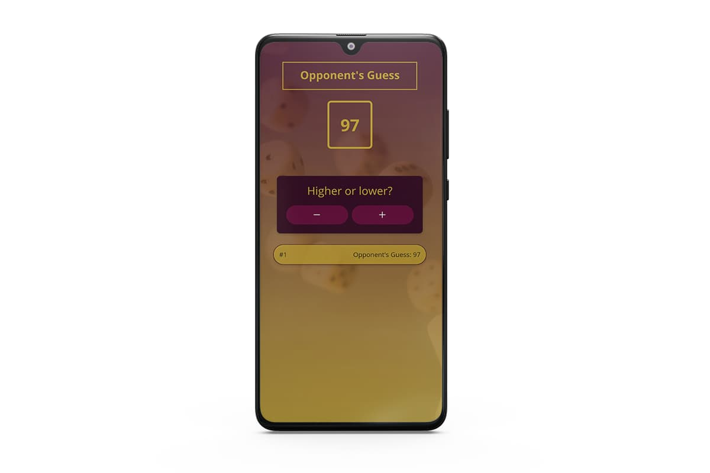
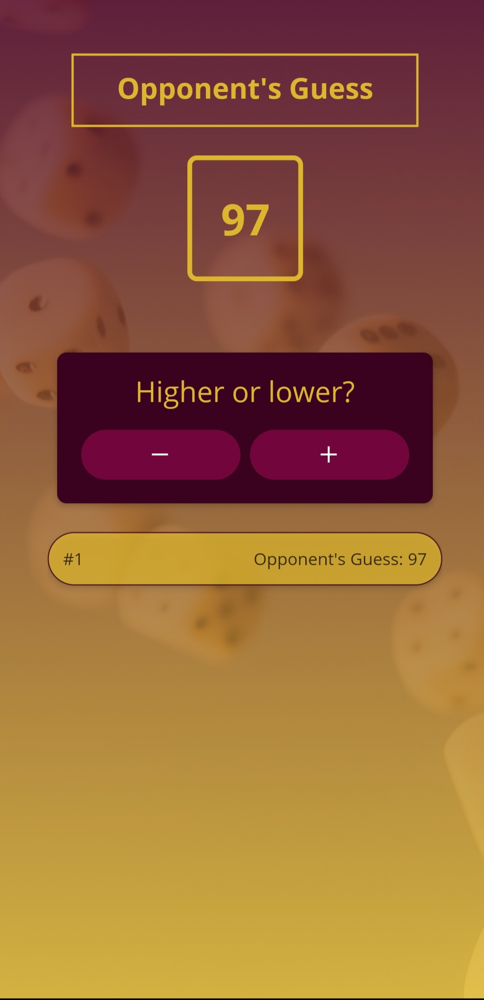
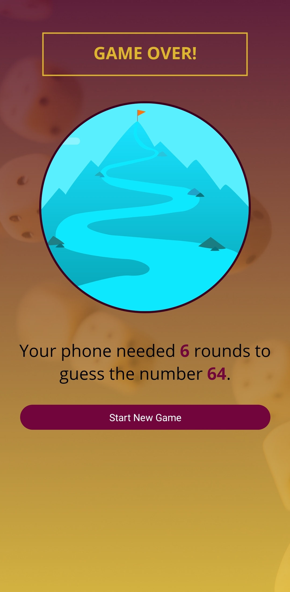

# Guess Number Game — React-Native

<p align="center" >
 
</p>

# Table of Contents

- [Guess Number Game — React-Native](#guess-number-game--react-native)
- [Table of Contents](#table-of-contents)
- [Instructions](#instructions)
- [Packages](#packages)
- [Application Images](#application-images)
  - [Home](#home)
  - [Number Guess](#number-guess)
  - [Game Over](#game-over)

# Instructions

- Clone repo
- Install dependencies by running `npm install`
- Run `expo start` to run the application using [Expo](https://expo.dev/)
- Download the [Expo Go](https://expo.dev/) App for iOS/Android on the App Store/Google Play
- Scan the QR code on the terminal to launch the App in Development Mode on your phone

# Packages

```
├── @babel/core@7.18.6
├── expo-app-loading@2.0.0
├── expo-font@10.1.0
├── expo-linear-gradient@11.3.0
├── expo-status-bar@1.3.0
├── expo@45.0.6
├── react-dom@17.0.2
├── react-native-web@0.17.7
├── react-native@0.68.2
└── react@17.0.2
```

# Application Images

## Home

<p align="center" >
 
</p>

## Number Guess

<p align="center" >
 
</p>

## Game Over

<p align="center" >
 
</p>
